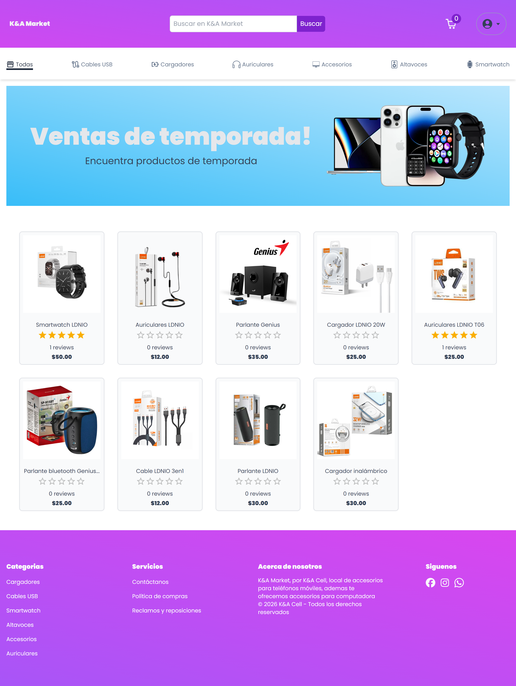
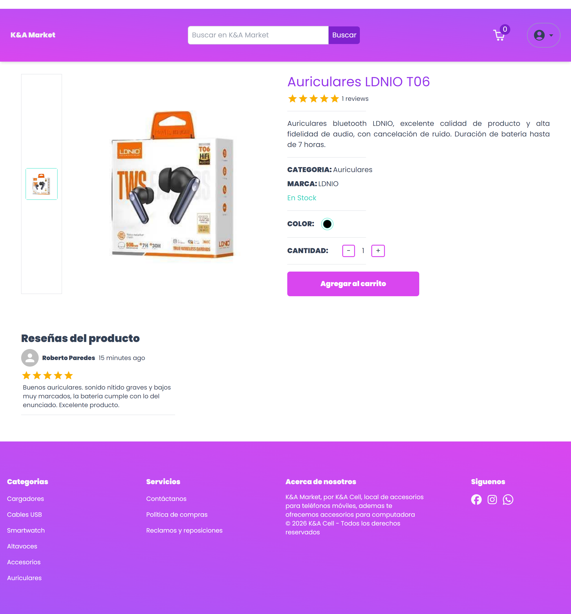
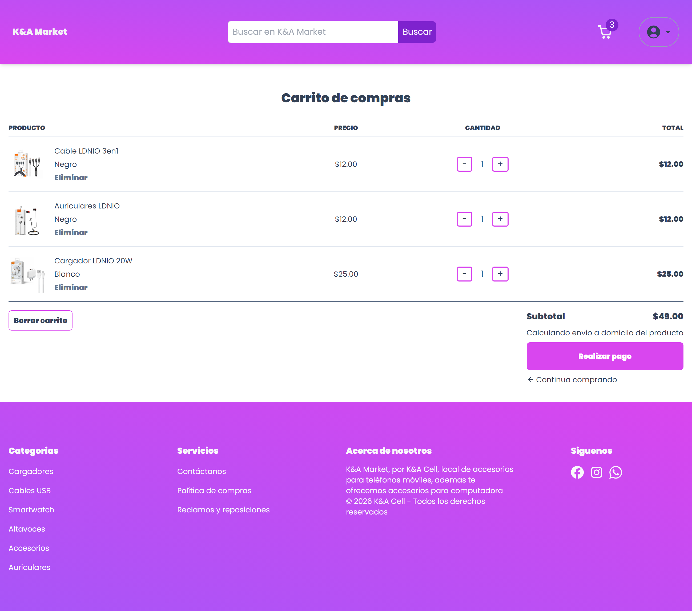
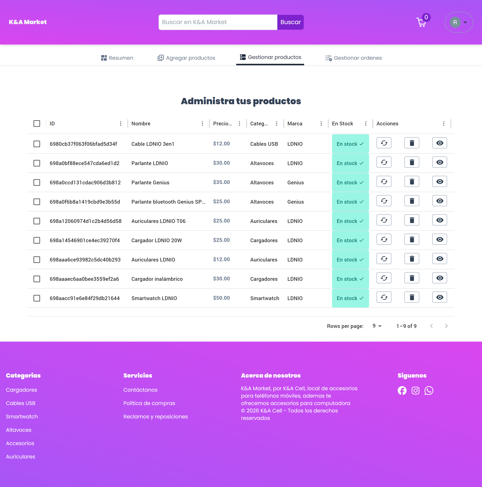

# 🛒 K&A Market

🚀 **K&A Market** es un **e-commerce fullstack**  desarrollado como proyecto de portafolio personal, con una visión clara de producto escalable y monetizable en el futuro.
Incluye una experiencia completa de compra para usuarios finales y un dashboard administrativo para la gestión del negocio.

🌍 **Demo en producción:**  
👉 https://kya-market.vercel.app/

---

🚀 Descripción del proyecto

K&A Market simula una tienda online moderna, enfocada en buenas prácticas de desarrollo frontend y backend, optimización de rendimiento y una arquitectura preparada para crecer.

El proyecto está pensado no solo como demostración técnica, sino como una base sólida para un producto real, con integraciones clave como pagos en línea, manejo de imágenes en la nube y análisis de ventas.

## ✨ Características principales

 Usuario

- 🔐 Autenticación de usuarios
- ⭐ Sistema de reviews
- 📲 Carrito de compras
- 💳 Pasarela de pagos con Stripe
- 🔍 Filtros por categoría
- 📱 Diseño responsive
- 🚫 Manejo de estados nulos
- ✔ Optimización de imágenes
- 🔎 Búsqueda por nombre

Dashboard Admin

- 🛍️ CRUD de productos
- 📊 Dashboard administrativo con gráficas
- 📈 Visualización de métricas y ventas

---

## 🧰 Tecnologías utilizadas

### Frontend

  

- Next.js
- React
- TypeScript
- Tailwind CSS

---

### Backend

  

- Prisma ORM
- MongoDB
- API Routes (Next.js)

---

### Servicios y herramientas

  

- Stripe (pagos)
- Cloudinary (gestión de imágenes)
- Git + Conventional Commits
- Deploy en Vercel
- Arquitectura preparada para escalar

---

✔ Buenas prácticas aplicadas

- Tipado estricto con TypeScript
- Eliminación de React.FC para un tipado más explícito
- Componentes reutilizables y desacoplados
- Commits semánticos (feat, fix, refactor, chore)
- Manejo seguro de datos nulos
- Optimización de carga de imágenes
- Código legible y mantenible

---

📦 Instalación y uso local
# Clonar repositorio
git clone https://github.com/Rob-Dev007/kya-market.git

# Entrar al proyecto
cd kya-market

# Instalar dependencias
npm install

# Ejecutar en desarrollo
npm run dev

###Configura tus variables de entorno (.env) para:

-MongoDB
-Stripe
-Cloudinary

---

📌 Convención de commits

Este proyecto sigue Conventional Commits, por ejemplo:

- feat(cart): agrega lógica de carrito de compras
- fix(product-card): gestiona datos nulos y agrega imagen fallback
- refactor(null-data): remueve React.FC y mejora espaciado en título
- chore(favicon): actualiza favicon del proyecto

Esto facilita el mantenimiento, escalabilidad y trabajo en equipo.

---

🎯 Objetivo del proyecto

Este proyecto fue desarrollado con énfasis en:

- ✅ Buenas prácticas de React y Next.js
- 🧩 Componentes reutilizables
- 🧠 Manejo correcto de estados nulos
- ⚙️ Tipado estricto con TypeScript
- 🧹 Código limpio y mantenible
- 📝 Commits semánticos (Conventional Commits)

---

## 👨‍💻 Autor

**Roberto Antonio Paredes Camacho**  
Desarrollador Web Fullstack

- 🌐 Portafolio: *(próximamente)*
- 💼 LinkedIn: *(opcional)*
- 🐙 GitHub: https://github.com/Rob-Dev007

---

## 🖼️ Capturas de pantalla

### 🏠 Home

### 📦 Página de producto

### 🛒 Carrito

### 🛠️ Dashboard Admin

---

## Notas técnicas

- Next.js fue actualizado para garantizar compatibilidad con el entorno de deploy.

---

⭐ Si este proyecto te resulta interesante, no dudes en dejar una estrella.
